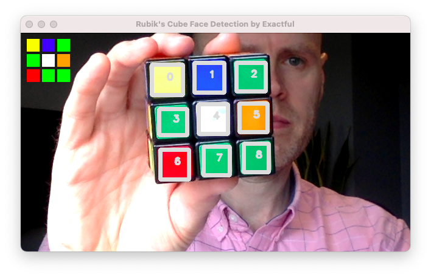

# Rubik's Cube Face Detection

An OpenCV-based computer vision project to detect the nine coloured stickers on each face of a Rubik's cube.

https://user-images.githubusercontent.com/48687462/204614974-75dfb6fe-2961-4526-abe6-ca9626b4e247.mov

## Installation and usage

```
git clone https://github.com/exactful/rubiks-cube-face-detection.git
cd rubiks-cube-face-detection
python3 -m venv venv
source venv/bin/activate
pip3 install -r requirements.txt
python3 detect.py
```

## Strategy

- Get the current frame from the webcam

- De-noise the image and detect vertical + horizontal edges

- Detect the contours

- Iterate the list and retain the contours that meet these requirements:

    - Polygon with four sides
    - Width and height are "squarish"
    - Width is between an upper and lower threshold
    - Area is greater than some threshold
    - Dominant colour is close enough to be one of the sticker colours

If the list contains nine contours after this step, there's a pretty good chance we have found the nine coloured stickers. However, we need to check the position of the contours to ensure they are distributed within a sensible distance of the contour in the centre.

- Order the contours based on their x, y position and find the centre contour

- Check the contours that are furthest to the left and right, and furthest to the top and bottom, are within a reasonable distance of the centre contour

- If yes, great. Draw the contour outlines and the colours detected on the face

## In action



## Points of interest

- Uses the OpenCV findContours method to detect contours
- Uses KMeans clustering (k=1) to identify the dominant colour in a contour
- Uses the CIEDE2000 colour difference to detect and match colours
- OpenCV requires BGR not RGB because reasons 

## Todo

- Option to calibrate colours to improve colour matching in different light conditions
- Solve the cube after capturing six sides; not a computer vision problem so not intending to do this
